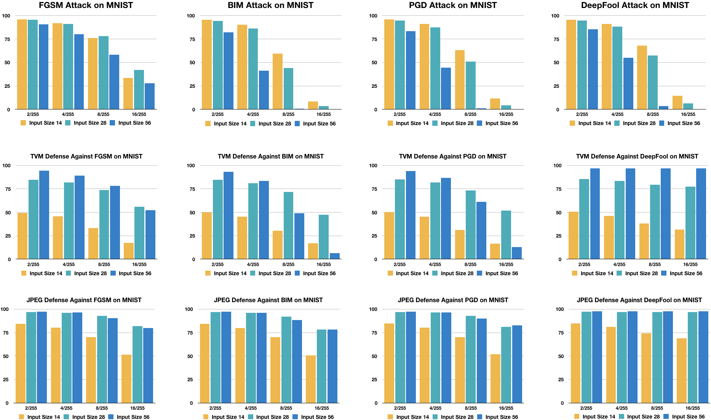
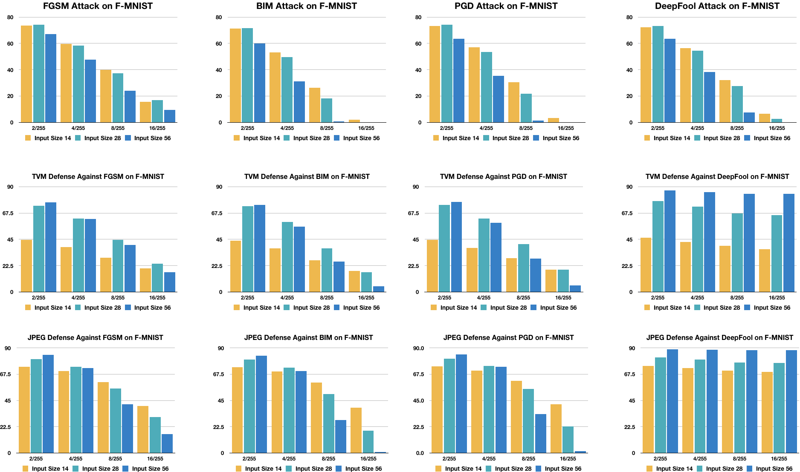
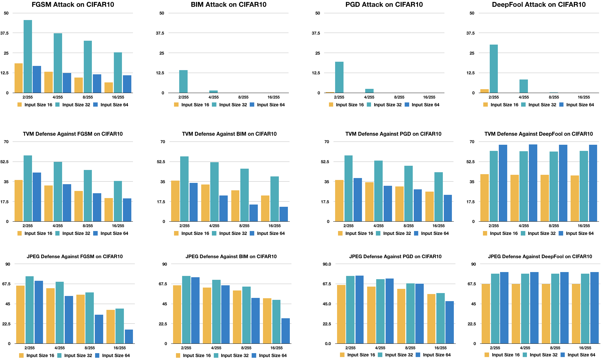
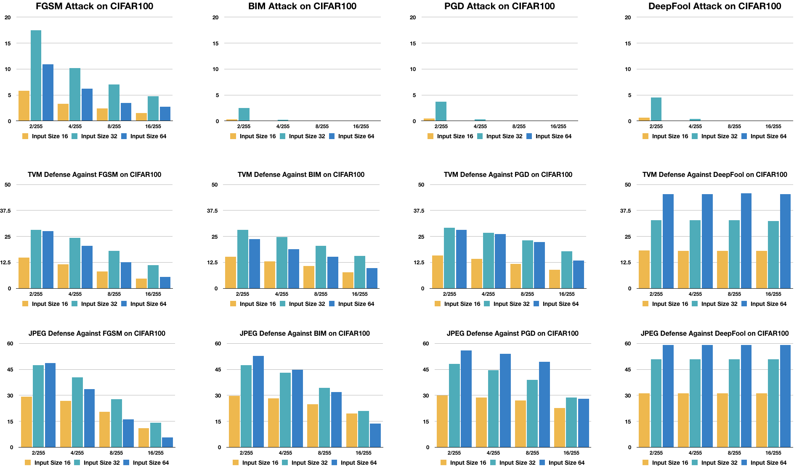
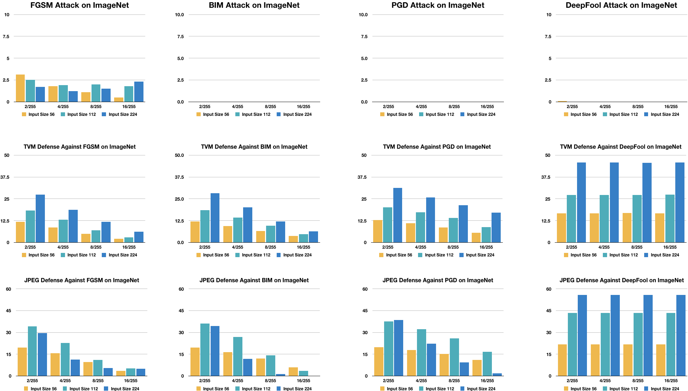
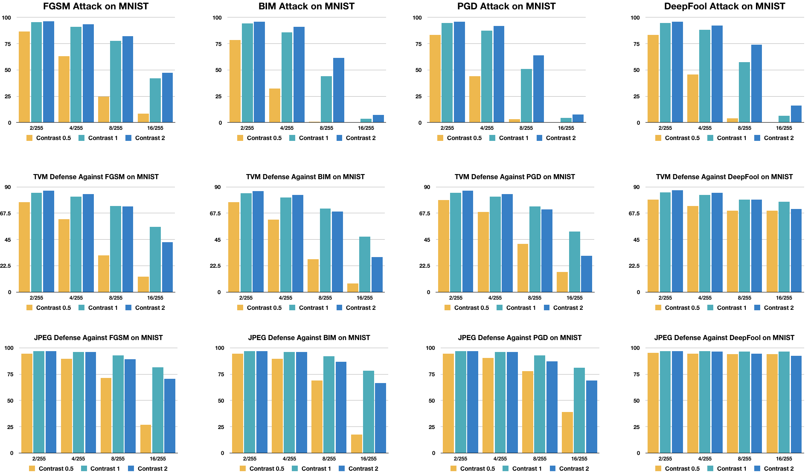
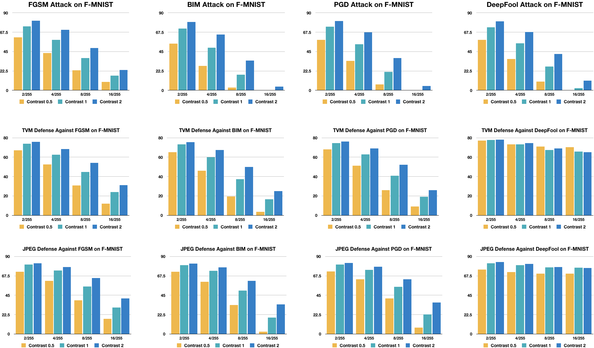
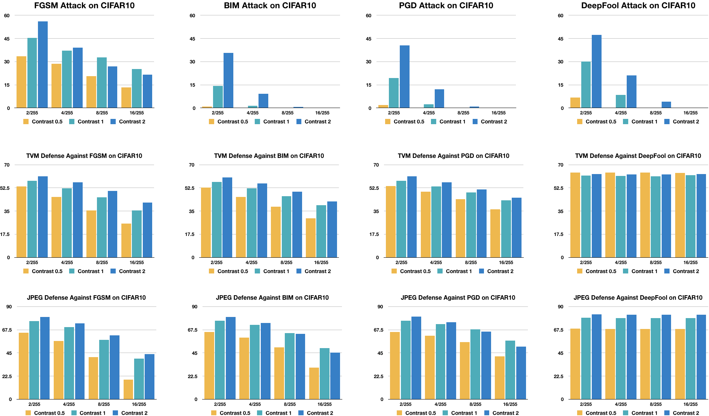
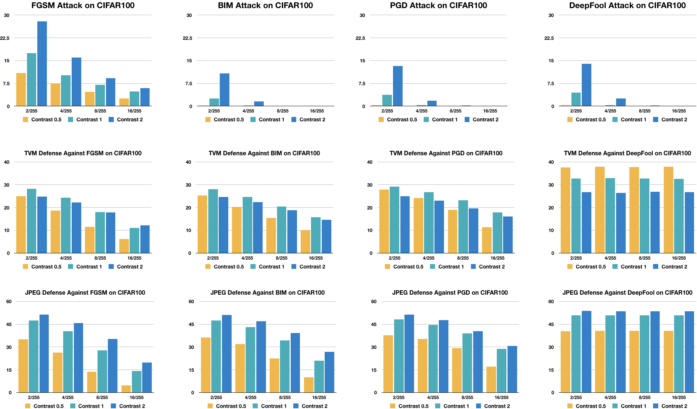
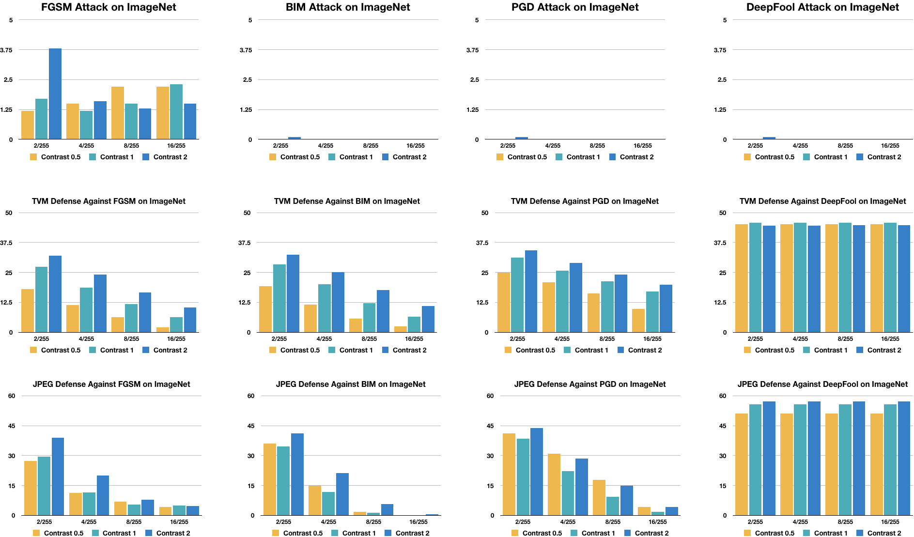

# Code for On Intrinsic Dataset Properties for Adversarial Machine Learning [[arXiv](https://arxiv.org/abs/2005.09170)]

In this work, we explore the effect of two intrinsic dataset properties, input size and image contrast, on adversarial robustness, testing on five popular image classification datasets — MNIST, Fashion-MNIST, CIFAR-10/CIFAR-100, and ImageNet. We find that input size and image contrast play key roles in attack and defense success. Our discoveries highlight that dataset design and data preprocessing steps are important to boost the adversarial robustness of DNNs.

```
@misc{pan2020intrinsic,
    title={On Intrinsic Dataset Properties for Adversarial Machine Learning},
    author={Jeffrey Z. Pan and Nicholas Zufelt},
    year={2020},
    eprint={2005.09170},
    archivePrefix={arXiv},
    primaryClass={cs.LG}
}
```

## Install

This code requires the following dependencies

- [PyTorch](https://pytorch.org/) >= 1.2.0
- Torchvision >= 0.4.0
- [ART](https://github.com/IBM/adversarial-robustness-toolbox) >= 1.2.0
- [Foolbox](https://foolbox.jonasrauber.de/) >= 3.0.0

Additionally, we evaluate on the following datasets:

- [MNIST](http://yann.lecun.com/exdb/mnist/)
- [Fashion-MNIST](https://github.com/zalandoresearch/fashion-mnist)
- [CIFAR-10/CIFAR-100](https://www.cs.toronto.edu/~kriz/cifar.html)
- [ImageNet](http://image-net.org/)

All of the above datasets can be installed through their respective `torchvision.datasets` classes by setting `download=True` in `lib/datasets/data_utils.py`, with the exception of ImageNet, which must be manually downloaded.

## Attacks and Defenses

I test the following attacks and defenses in this repo:

Attacks

- [FGSM](https://arxiv.org/abs/1412.6572)
- [BIM](https://arxiv.org/abs/1607.02533)
- [PGD](https://arxiv.org/abs/1706.06083)
- [DeepFool](https://arxiv.org/abs/1511.04599)

Defenses

- [Total Variance Minimization](https://arxiv.org/abs/1711.00117)
- [JPEG Compression](https://arxiv.org/abs/1711.00117)

## Usage

We provide pretrained models for each dataset and contrast/image size combination:

| Model (contrast setting, input size, dataset) | Download                                                                             |
|-----------------------------------------------|--------------------------------------------------------------------------------------|
| Contrast 0.5x 28 MNIST                        | https://drive.google.com/drive/folders/1EQ62QcDnCBiQQ-1myAl4jQfz-fPq5gEC?usp=sharing |
| Contrast 0.5x 28 Fashion-MNIST                | https://drive.google.com/drive/folders/1qCpyf4CsiFFKYoXMelHdle0ILWjI00Ok?usp=sharing |
| Contrast 0.5x 32 CIFAR-10                     | https://drive.google.com/drive/folders/18qqzJ9_hbLc911b59HZnHdebF-K_d9aY?usp=sharing |
| Contrast 0.5x 32 CIFAR-100                    | https://drive.google.com/drive/folders/1WpXjWLMIsgGRSh1pJbrjlbGTOluEsp5l?usp=sharing |
| Contrast 0.5x 224 ImageNet                    | https://drive.google.com/drive/folders/1hJIRT8ECmzVubwM1EfeQJhJoWImC7zK2?usp=sharing |
| Contrast 1x 14 MNIST                          | https://drive.google.com/drive/folders/110hkVJJ2TW1dETL9eX6QBsTlTGdoqMHh?usp=sharing |
| Contrast 1x 28 MNIST                          | https://drive.google.com/drive/folders/1MWE-WkZFELT8MFiFif2uC36kjBK9-M7j?usp=sharing |
| Contrast 1x 56 MNIST                          | https://drive.google.com/drive/folders/1W0w2op0OxtFYKEU-pzXZh9HudQnuq85X?usp=sharing |
| Contrast 1x 14 Fashion-MNIST                  | https://drive.google.com/drive/folders/1eJCb9SqIOz6u2efkVirxjowSs-wwkia-?usp=sharing |
| Contrast 1x 28 Fashion-MNIST                  | https://drive.google.com/drive/folders/1WBy18ujY86YPFHZCa8hHk_rZJHuLr_jv?usp=sharing |
| Contrast 1x 56 Fashion-MNIST                  | https://drive.google.com/drive/folders/1ihfU9KFSJw3QkJwEnCQI34diosKasLjD?usp=sharing |
| Contrast 1x 16 CIFAR-10                       | https://drive.google.com/drive/folders/1KmyIDqfEKRG07WEStswkGjk_9r9PWnpB?usp=sharing |
| Contrast 1x 32 CIFAR-10                       | https://drive.google.com/drive/folders/1ueE0mkqNA3BlBbjv8otG-J_tGqgeKbrT?usp=sharing |
| Contrast 1x 64 CIFAR-10                       | https://drive.google.com/drive/folders/1sHujcFzbhhDfShe_BviKnY3ZUiST1R8v?usp=sharing |
| Contrast 1x 16 CIFAR-100                      | https://drive.google.com/drive/folders/1eoL6UhUKqUiS11HG8jX2TMsnNDEnUO24?usp=sharing |
| Contrast 1x 32 CIFAR-100                      | https://drive.google.com/drive/folders/1Ku1PgqwfgwUz2WeRE9se8fssrMYWHrPn?usp=sharing |
| Contrast 1x 64 CIFAR-100                      | https://drive.google.com/drive/folders/1qOatyoThvlv04WVTEX7jwpkAfrUpFlim?usp=sharing |
| Contrast 1x 56 ImageNet                       | https://drive.google.com/drive/folders/1y5FA7oe1Bd4UsdZduCaukuQUVl_Fz916?usp=sharing |
| Contrast 1x 112 ImageNet                      | https://drive.google.com/drive/folders/1pBz3S48H9dZFRmJPBYqs1VtjiYPht3in?usp=sharing |
| Contrast 1x 224 ImageNet                      | https://drive.google.com/drive/folders/174UT9MDuUqa9kc_nIb81lJdBjmecB1Oh?usp=sharing |
| Contrast 2x 28 MNIST                          | https://drive.google.com/drive/folders/1oC_83FcwLEgagUZTFXSeyz8hf6Xc-32g?usp=sharing |
| Contrast 2x 28 Fashion-MNIST                  | https://drive.google.com/drive/folders/1C3DLl1-uqScqfwE_Ri-PmOcdN08JpWL1?usp=sharing |
| Contrast 2x 32 CIFAR-10                       | https://drive.google.com/drive/folders/1R4CAIarUvoq5J9KA1H2uGei9YFTP4sPw?usp=sharing |
| Contrast 2x 32 CIFAR-100                      | https://drive.google.com/drive/folders/1cov7wYiBeVuHMkyQZW29pKTjFjCOYVxD?usp=sharing |
| Contrast 2x 224 ImageNet                      | https://drive.google.com/drive/folders/1-e7WsjplMyJAJENBHMV1Z47CihLWpTvO?usp=sharing |

To run an experiment for all datasets, use the scripts in the `scripts` directory.

```
GPU=0,1,2,3
INPUT_SIZE=32
CONTRAST=1 (leave as 1 for default contrast)

./scripts/run_{dataset_name}.sh GPU INPUT_SIZE CONTRAST
```

Due to the excessive runtime of ImageNet experiments, we recommend using the `attack_imagenet.sh` script in the `scripts` directory, as that script runs a single attack with a given epsilon value, rather than running all epsilon values and all attacks for a dataset. 

```
GPU=0,1,2,3
ATTACK=fgsm from {fgsm,bim,pgd,deepfool}
EPS=0.06274 (16/255)
INPUT_SIZE=224
CONTRAST=1 (leave as 1 for default contrast)

./scripts/run_{dataset_name}.sh GPU ATTACK EPS INPUT_SIZE CONTRAST
```

## Input Size Results 


*The effects of input image size on adversarial robustness for the MNIST dataset. Each row represents a given defense (no defense, TVM, and JPEG) while each column represents a given attack (FGSM, BIM, PGD, DeepFool). Four different epsilon values are used in every attack-defense combination: 2/255, 4/255, 8/255, and 16/255.*


*The effects of input image size on adversarial robustness for the Fashion-MNIST dataset. Each row represents a given defense (no defense, TVM, and JPEG) while each column represents a given attack (FGSM, BIM, PGD, DeepFool). Four different epsilon values are used in every attack-defense combination: 2/255, 4/255, 8/255, and 16/255.*


*The effects of input image size on adversarial robustness for the CIFAR-10 dataset. Each row represents a given defense (no defense, TVM, and JPEG) while each column represents a given attack (FGSM, BIM, PGD, DeepFool). Four different epsilon values are used in every attack-defense combination: 2/255, 4/255, 8/255, and 16/255.*


*The effects of input image size on adversarial robustness for the CIFAR-100 dataset. Each row represents a given defense (no defense, TVM, and JPEG) while each column represents a given attack (FGSM, BIM, PGD, DeepFool). Four different epsilon values are used in every attack-defense combination: 2/255, 4/255, 8/255, and 16/255.*


*The effects of input image size on adversarial robustness for the ImageNet dataset. Each row represents a given defense (no defense, TVM, and JPEG) while each column represents a given attack (FGSM, BIM, PGD, DeepFool). Four different epsilon values are used in every attack-defense combination: 2/255, 4/255, 8/255, and 16/255.*

## Image Contrast Results 


*The effects of image contrast on adversarial robustness for the MNIST dataset. Each row represents a given defense (no defense, TVM, and JPEG) while each column represents a given attack (FGSM, BIM, PGD, DeepFool). Four different epsilon values are used in every attack-defense combination: 2/255, 4/255, 8/255, and 16/255.*


*The effects of image contrast on adversarial robustness for the Fashion-MNIST dataset. Each row represents a given defense (no defense, TVM, and JPEG) while each column represents a given attack (FGSM, BIM, PGD, DeepFool). Four different epsilon values are used in every attack-defense combination: 2/255, 4/255, 8/255, and 16/255.*


*The effects of image contrast on adversarial robustness for the CIFAR-10 dataset. Each row represents a given defense (no defense, TVM, and JPEG) while each column represents a given attack (FGSM, BIM, PGD, DeepFool). Four different epsilon values are used in every attack-defense combination: 2/255, 4/255, 8/255, and 16/255.*


*The effects of image contrast on adversarial robustness for the CIFAR-100 dataset. Each row represents a given defense (no defense, TVM, and JPEG) while each column represents a given attack (FGSM, BIM, PGD, DeepFool). Four different epsilon values are used in every attack-defense combination: 2/255, 4/255, 8/255, and 16/255.*


*The effects of image contrast on adversarial robustness for the ImageNet dataset. Each row represents a given defense (no defense, TVM, and JPEG) while each column represents a given attack (FGSM, BIM, PGD, DeepFool). Four different epsilon values are used in every attack-defense combination: 2/255, 4/255, 8/255, and 16/255.*
